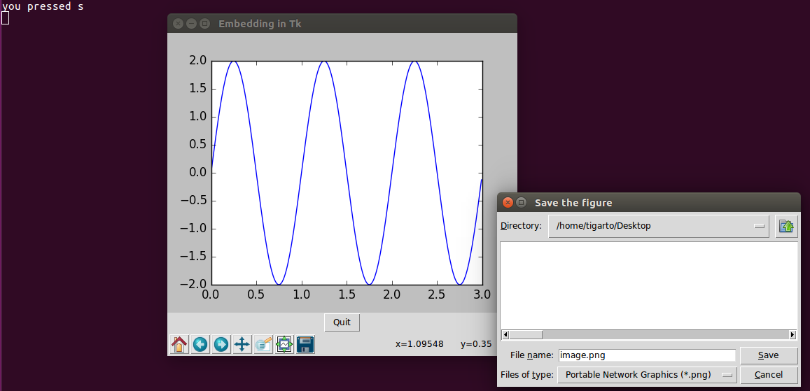

# Ejemplos #

## Ejemplo 1 ##

**Codigo**: 

[example1.py](example1.py)

**Ejecución**:

```bash
python3 example1.py
```

A continuación se muestra la salida en pantalla:


Una forma mas apropiada es codificar el ejemplo anterior usando POO. En archivo [example1_POO.py](example1_POO.py) se muestra esto. La salida es la misma que para el caso no orientado a objetos.

## Ejemplo 2 ##

**Codigo**: 

[example2.py](example2.py)

**Ejecución**:

```bash
python3 example2.py
```

A continuación se muestra la salida en pantalla:



La imagen guardada en el escritorio cuando se presionó la tecla **s** se muestra a continuación:


Una forma mas apropiada es codificar el ejemplo anterior usando POO. En archivo [example2_POO.py](example2_POO.py) se muestra esto. La salida es la misma que para el caso no orientado a objetos.

## Referencias ##
1. [tkinter — Python interface to Tcl/Tk](https://docs.python.org/3/library/tkinter.html#)