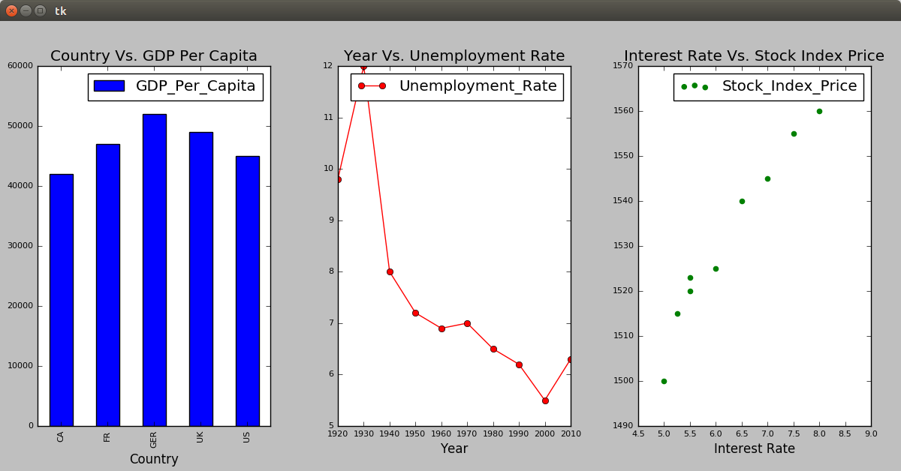
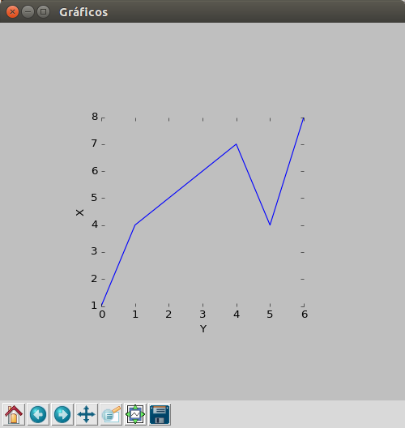
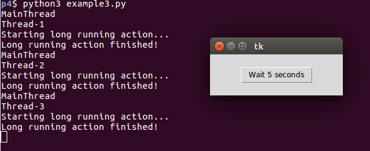

# Ejemplos #

## Ejemplo 1 ##

**Codigo**: 

[example1.py](example1.py)

**Ejecución**:

```bash
python3 example1.py
```

A continuación se muestra la salida en pantalla:



## Ejemplo 2 ##

**Codigo**: 

[example2.py](example2.py)

**Ejecución**:

```bash
python3 example2.py
```

A continuación se muestra la salida en pantalla:



## Ejemplo 3 ##

**Codigo**: 

[example3.py](example3.py)

**Ejecución**:

```bash
python3 example3.py
```

En este ejemplo se hace uso de hilos. A continuación se muestra la salida en pantalla:



## Referencias ##
1. [tkinter — Python interface to Tcl/Tk](https://docs.python.org/3/library/tkinter.html#)
2. https://datatofish.com/matplotlib-charts-tkinter-gui/
3. https://datatofish.com/how-to-create-a-gui-in-python/
4. http://www.pythondiario.com/2018/09/incrustar-graficos-matplotlib-en-tkinter.html
5. https://www.bogotobogo.com/python/Multithread/python_multithreading_creating_threads.php
6. https://pythonprogramming.net/threading-tutorial-python/
7. https://www.python-course.eu/threads.php

