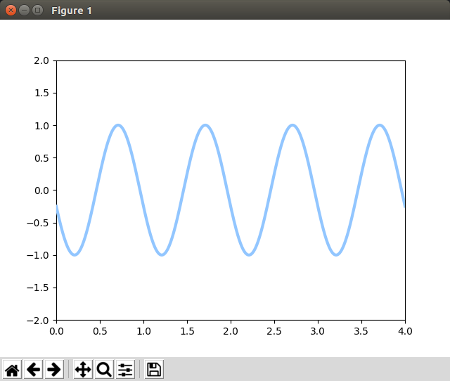
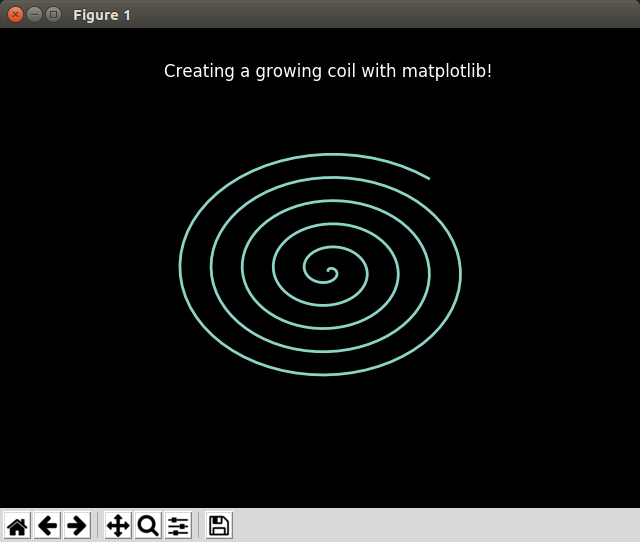
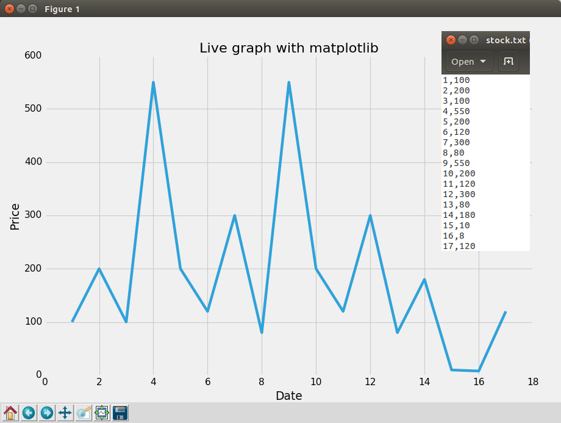

# Ejemplos #

## Ejemplo 1 ##

**Codigo**: 

[example1_en1.py](example1_en1.py)

**Ejecución**:

```bash
python example1_en1.py
```

A continuación se muestra la salida en pantalla:



## Ejemplo 2 ##

**Codigo**: 

[example2_en1.py](example2_en1.py)

**Ejecución**:

```bash
python example2_en1.py
```

A continuación se muestra la salida en pantalla:



## Ejemplo 3 ##

**Codigo**: 

[example2_en1.py](example3_en1.py)

**Ejecución**:

```bash
python3 example3_en1.py
```

El archivo de texto leido en este ejemplo para es: [stock.txt](stock.txt)

A continuación se muestra la salida en pantalla:




## Referencias ##

1. [Live Graphs with Matplotlib](https://pythonprogramming.net/live-graphs-matplotlib-tutorial/)