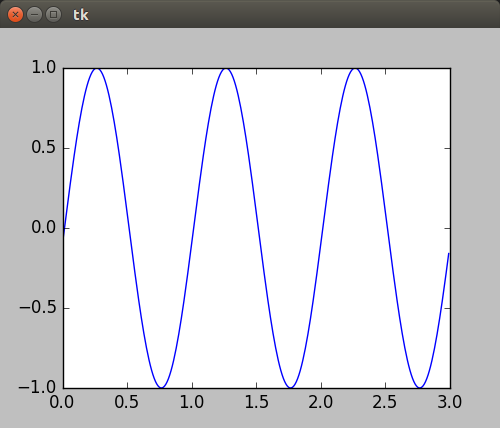
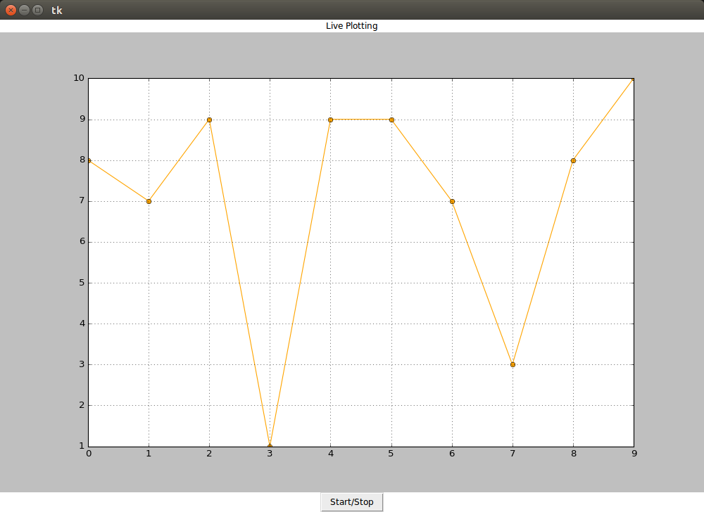

# Ejemplos #

## Ejemplo 1 ##

**Codigo**: 

[ejemplo1.py](ejemplo1.py)

**Ejecución**:

```bash
python3 ejemplo1.py
```
A continuación se muestra la salida en pantalla:



## Ejemplo 2 ##

**Codigo**: 

[ejemplo2.py](ejemplo2.py)

**Ejecución**:

```bash
python3 ejemplo2.py
```

A continuación se muestra la salida en pantalla:



