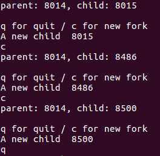
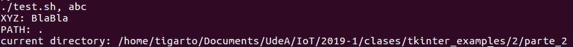
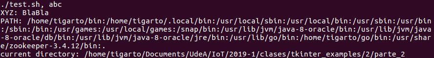
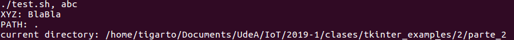

# Ejemplos - Forks und forking in Python #


## Parte 1 - (fork - Fork in Python - Starting independent Processes via fork())

Los siguientes ejemplos se tomaron del enlace: [Python and the Shell](https://www.python-course.eu/os_module_shell.php)


### Ejemplo 1 ###

**Codigo**: 

[example1.py](example1.py)

**Ejecución**:

```bash
python3 example1.py
```

A continuación se muestra la salida en pantalla:



## Parte 2 - (The exec*()-Functions)


### Ejemplo 2.1 ###

**Codigos relacionados**:
1.  [example2_1.py](example2_1.py)
2.  [test.sh](test.sh)

Antes de lanzar el programa de python cambiar los permisos al script e linux:

```bash
chmod 755 test.sh
```

**Ejecución**:

```bash
python3 example2_1.py
```

La salida en pantalla se muestra a continuación:



### Ejemplo 2.2 ###

**Codigo**:

[example2_2.py](example2_2.py)

**Ejecución**:

```bash
python3 example2_2.py
```

La salida en pantalla se muestra a continuación:



### Ejemplo 2.3 ###

**Codigo**:

[example2_3.py](example2_3.py)

**Ejecución**:

```bash
python3 example2_3.py
```

La salida en pantalla se muestra a continuación:



