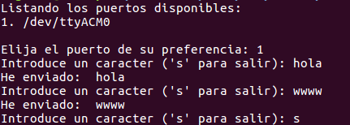
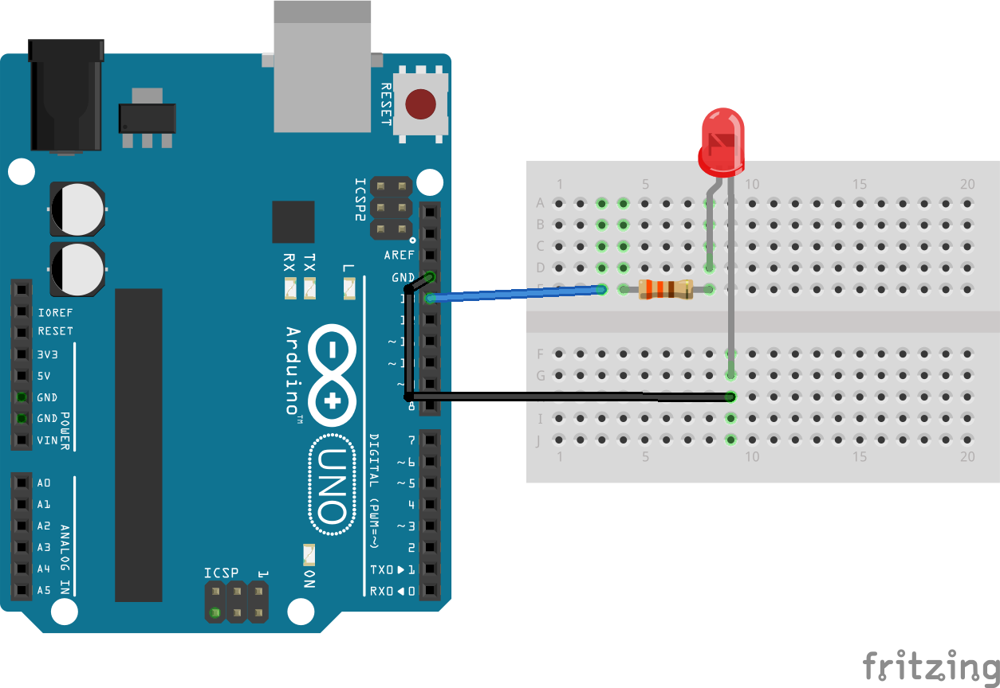
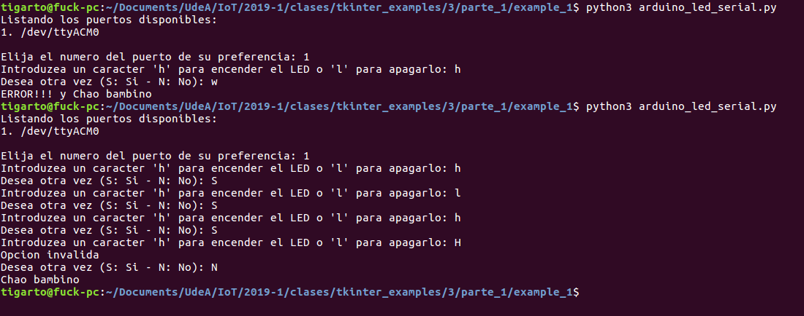
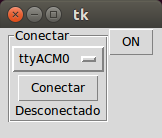
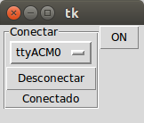
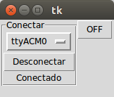

## Ejemplos ##

## Ejemplo 1 ##

Hacer un programa que permita hacer un echo con el arduino usando python.

**Codigo arduino**: No disponible

**Codigo python**: [echo_example.py](echo_example.py)

```python
import serial #cargamos la libreria serial


import serial.tools.list_ports

i = 1
print("Listando los puertos disponibles: ")
ports = serial.tools.list_ports.comports(include_links=False)
for port in ports :
    print(str(i) + '. ' + port.device)

indice_puerto = int(input("\nElija el puerto de su preferencia: "))
indice_puerto -= 1
ser = serial.Serial(port[indice_puerto], 9600) #inicializamos el puerto de serie a 9600 baud

#variable para almacenar el mensaje
#le asignamos un valor introducido por el usuario
entrada = input("Introduce un caracter ('s' para salir): ")
while entrada != 's': #introduciendo 's' salimos del bucle
    ser.write(entrada.encode("ascii","ignore")) #envia la entrada por serial
    print("He enviado: ", entrada)
    entrada = input("Introduce un caracter ('s' para salir): ")
ser.close()
```

La salida del codigo anterior se muestra a continuación:



## Ejemplos 2 y 3 ##

La conexión y el codigo asociado al arduino es el mismo para los ejemplos 2 y 3.

### Conexión ###



### Codigo arduino ###

**Arhivo**: [arduino_led_serial.ino](./arduino_led_serial/arduino_led_serial.ino)

```C++

byte byteRead;

void setup() {
  // initialize digital pin LED_BUILTIN as an output.
  pinMode(LED_BUILTIN, OUTPUT);
  // Turn the Serial Protocol ON
  Serial.begin(9600);
  
}


void loop() {
  /* check if data has been sent from the computer: */
  if (Serial.available()) {
    /* read the most recent byte */
    byteRead = Serial.read();
    if(byteRead == 'h') {
      digitalWrite(LED_BUILTIN, HIGH);
    }
    else if(byteRead == 'l') {
      digitalWrite(LED_BUILTIN, LOW);
    }
  }
}
```

## Ejemplo 2 - Interfaz por consola ##

Hacer un programa que permita apagar y prender un arduino mediante el puerto serial empleando una aplicación en python por consola.

**Codigo python**: [arduino_led_serial.py](arduino_led_serial.py)


```python
import serial #cargamos la libreria serial

import serial.tools.list_ports

i = 1
print("Listando los puertos disponibles: ")
ports = serial.tools.list_ports.comports(include_links=False)
for port in ports :
    print(str(i) + '. ' + port.device)

indice_puerto = int(input("\nElija el numero del puerto de su preferencia: "))
indice_puerto -= 1
ser = serial.Serial(port[indice_puerto], 9600) #inicializamos el puerto de serie a 9600 baud

#variable para almacenar el mensaje
#le asignamos un valor introducido por el usuario
old_value = 'l'
while True:
    entrada = input("Introduzea un caracter 'h' para encender el LED o 'l' para apagarlo: ")
    # Se verifica si cambia el valor ingresado para ver si se justifica mandar el comando
    if entrada != old_value:
        if entrada == 'h' or entrada == 'l':
            ser.write(entrada.encode("ascii","ignore")) #envia la entrada por serial
        else:
            print("Opcion invalida")
        old_value = entrada
    otra_vez = input("Desea otra vez (S: Si - N: No): ")
    if otra_vez == 'N':
        print("Chao bambino")
        break
    elif otra_vez != 'S':
        print("ERROR!!! y Chao bambino")
        break
ser.close()
```

## Procedimiento de ejecución

1. Realizar las conexiones mostradas en la protoboard.
2. Descargar el programa en el arduino.
3. Correr el script el python.

```
python3 arduino_led_serial.py
```


4. Interactuar con la aplicación.

La salida en pantalla se muestra a continuación:




## Ejemplo 3 - Interfaz grafica ##


Hacer un programa que permita apagar y prender un arduino mediante el puerto serial empleando una interfaz grafica diseñada en python

**Codigo python**: [arduino_led_serial_ui1.py](arduino_led_serial_ui1.py)

```python
from tkinter import *
import serial #cargamos la libreria serial
import serial.tools.list_ports


class UILedSerial(Frame):
    def __init__(self,master = None):
        Frame.__init__(self, master)
        self.pack()
        # Variables de la aplicacion
        self.port_sel = StringVar(self)
        self.banConectar = False
        self.ledState = False


        ports = serial.tools.list_ports.comports(include_links=False)
        self.dic_ports = {}
        for port in ports:
            self.dic_ports[port.name] = port.device
        
        list_ports = list(self.dic_ports.keys())
        

        self.port_sel.set(list_ports[0]) # default value

        # Agregando frames principales       
        self.mainFrame = Frame(self)         
        self.fConectar = LabelFrame(self,text="Conectar")
        self.optionSer = OptionMenu(self.fConectar, self.port_sel, *list_ports)
        self.bConnectar = Button(self.fConectar,text = "Conectar", command = self.conectar)
        self.lConectar = Label(self.fConectar,text = "Desconectado")
        self.optionSer.pack()
        self.bConnectar.pack()
        self.lConectar.pack()

        self.fControl = Frame(self)
        self.bOnOff = Button(self.fControl,text = "ON", command = self.on_off_light)
        self.bOnOff.pack()

        self.fConectar.pack(side = 'left',fill = Y,expand= YES)
        self.fControl.pack(side = 'right',fill = Y,expand= YES)

    def on_off_light(self):
        if self.ledState == False:
            self.ser.write('h'.encode("ascii","ignore")) #envia la entrada por serial
            self.bOnOff.config(text = "OFF")
            self.ledState = True
        else:
            self.ser.write('l'.encode("ascii","ignore"))
            self.bOnOff.config(text = "ON")
            self.ledState = False

    def conectar(self):
        if self.banConectar == False:
            print("Conectando a: " + self.port_sel.get())  
            self.ser = serial.Serial(self.dic_ports[self.port_sel.get()], 9600)  
            self.bConnectar.config(text = "Desconectar")
            self.lConectar.config(text = 'Conectado')
            self.banConectar = True
        else:
            print("Desconectanto de: " + self.port_sel.get())  
            self.ser.close()
            self.bConnectar.config(text = "Conectar")
            self.lConectar.config(text = 'Desconectado')
            self.banConectar = False


# Allow the class to run stand-alone.
if __name__ == "__main__":
    app = UILedSerial()
    app.mainloop()
```

## Procedimiento de ejecución

1. Realizar las conexiones mostradas en la protoboard.
2. Descargar el programa en el arduino.
3. Correr el script el python.

```
python3 arduino_led_serial_ui1.py
```


4. Interactuar con la aplicación.

La salida en pantalla se muestra a continuación para varios casos:

* Caso inicial: Antes de conectar el puerto:



* Caso para prender el led: Una vez se presiona el boton ON se enciende el led y el contenido en este pasa a OFF. 




* Caso para apagar el led: Una vez se presiona el boton OFF se apaga el led y el contenido de este pasa a ON.




## Enlaces

[How to Use a Breadboard](https://www.sciencebuddies.org/science-fair-projects/references/how-to-use-a-breadboard)
