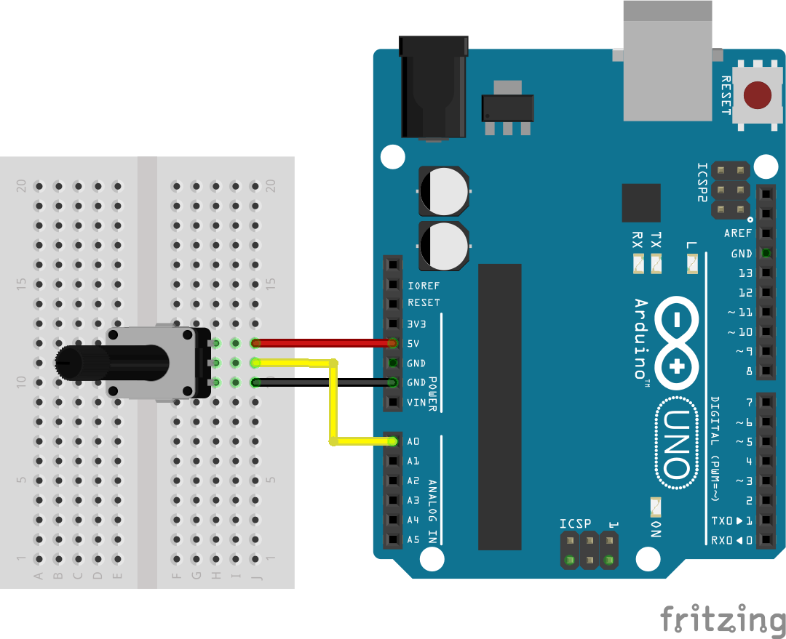
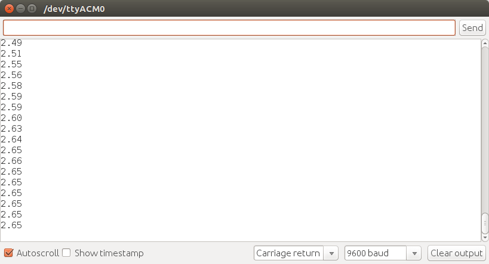
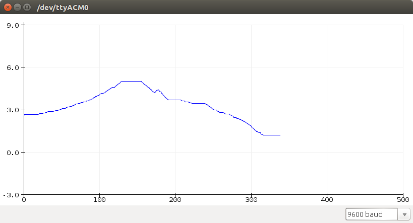

# Parte asociada al arduino #

## Diagrama de conexion ##



## Codigo ##

**Codigo arduino**: [analog_serial.ino](analog_serial.ino)

```C++
// Read analog values from A0 and print them to serial port.

void setup() {
  // initialize serial comms
  Serial.begin(9600); 
}

void loop() {
  // read A0
  float data = analogRead(A0);
  data = (data/1024.00) * 5;
  String dataToSend = String(data);
  Serial.println(dataToSend);
  // wait 
  delay(300);  
}

```

## Salida en el monitor serial ##




## Salida en el ploter serial ##





