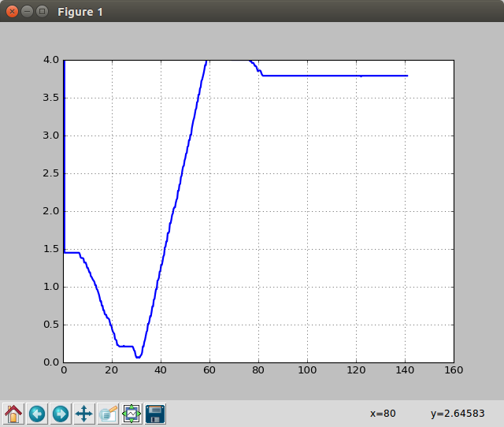

```python
"""
===========
Random data
===========

An animation of random data.

"""

import numpy as np
import matplotlib.pyplot as plt
import matplotlib.animation as animation
import serial
from matplotlib.lines import Line2D

# Fixing random state for reproducibility

import numpy as np
import matplotlib.pyplot as plt
import matplotlib.animation as animation

port = '/dev/ttyACM0'
i=0
ser = serial.Serial(port,9600)
ser.close()
ser.open()


def data_gen(t=0):
    while True:
        t += 0.3 # Por tomae muestras cada 300 ms
        y = float(ser.readline().strip())
        #print(y)
        yield t, y


def init():
    ax.set_ylim(0, 4)
    ax.set_xlim(0, 10)
    del xdata[:]
    del ydata[:]
    line.set_data(xdata, ydata)
    return line,

fig, ax = plt.subplots()
line, = ax.plot([], [], lw=2)
ax.grid()
xdata, ydata = [], []


def run(data):
    # update the data
    t, y = data
    xdata.append(t)
    ydata.append(y)
    xmin, xmax = ax.get_xlim()

    if t >= xmax:
        ax.set_xlim(xmin, 2*xmax)
        ax.figure.canvas.draw()
    line.set_data(xdata, ydata)

    return line,


ani = animation.FuncAnimation(fig, run, data_gen, blit=False, interval=100,
                              repeat=False, init_func=init)
plt.show()

```


