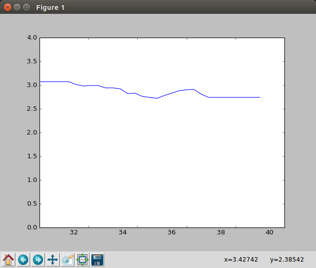

```python
"""
============
Oscilloscope
============

Emulates an oscilloscope.
"""
import numpy as np
from matplotlib.lines import Line2D
import matplotlib.pyplot as plt
import matplotlib.animation as animation
import serial

# Comunicacion serial
port = '/dev/ttyACM0'
ser = serial.Serial(port,9600)
ser.close()
ser.open()


class Scope(object):
    def __init__(self, ax, maxt=10, dt=0.3):
        self.ax = ax
        self.dt = dt
        self.maxt = maxt
        self.tdata = [0]
        self.ydata = [0]
        self.line = Line2D(self.tdata, self.ydata)
        self.ax.add_line(self.line)
        self.ax.set_ylim(0, 4)
        self.ax.set_xlim(0, self.maxt)

    def update(self, y):
        lastt = self.tdata[-1]
        if lastt > self.tdata[0] + self.maxt:  # reset the arrays
            self.tdata = [self.tdata[-1]]
            self.ydata = [self.ydata[-1]]
            self.ax.set_xlim(self.tdata[0], self.tdata[0] + self.maxt)
            self.ax.figure.canvas.draw()

        t = self.tdata[-1] + self.dt
        self.tdata.append(t)
        self.ydata.append(y)
        self.line.set_data(self.tdata, self.ydata)
        return self.line,


def captureData():
    'return a random value with probability p, else 0'
    while True:
        v = float(ser.readline().strip())
        yield v


fig, ax = plt.subplots()
scope = Scope(ax)

# pass a generator in "emitter" to produce data for the update func
ani = animation.FuncAnimation(fig, scope.update, captureData, interval=100,
                              blit=True)


plt.show()
```


