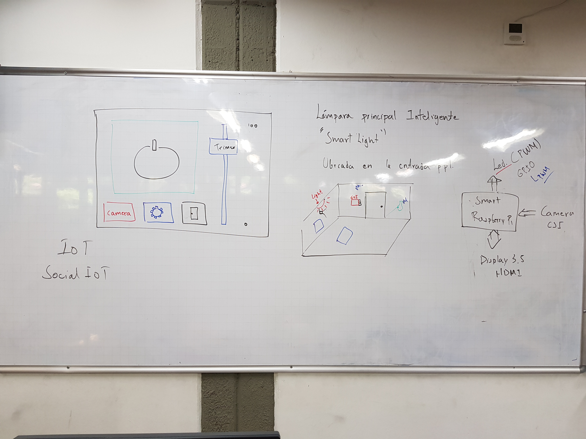

# "Smart Light" Raspberry pi

La practica consiste en desarrollar el primer dispositivo (o cosa) para el proyecto de Domótica IoT. El dispositivo es un control inteligente de luminosidad el cual involucra múltiples elementos: una pantalla táctil, una lámpara (se usará un LED en el prototipo) y una cámara.

La interfaz gráfica consta de 5 elementos tal y como lo muestra la siguiente imagen:

**Elementos**:
1. Un botón de on/off
2. Un botón de cámara
3. Un botón de configuración
4. Un botón de salida
5. Una barra de desplazamiento (scrollbar).

**Funcionalidad mínima del prototipo**:
1. El prototipo debe controlar un LED a través de PWM para controlar su nivel de luminosidad. La idea es que el botón on/off será usado para encender y apagar el LED, y la barra de desplazamiento para controlar el nivel de luminosidad del LED (ciclo de dureza del pwm). Recuerde ser muy cuidadoso con las conexiones eléctricas del LED, evite realizar conexiones con el sistema alimentado y no olvide la resistencia de mínimo 100 ohm en serie con el LED para limitar la corriente.
2. Al presionar el botón de "cámara" el sistema deberá determinar el estado del LED. Si está apagado deberá encenderlo en el máximo nivel de luminosidad durante 5 segundos y tomar una foto durante ese tiempo, luego deberá apagarlo. Si está encendido, el sistema deberá aumentar el nivel de luminosidad al máximo por 5 segundos, tomar la foto durante ese tiempo y luego llevar el LED al estado anterior.
3. El botón de exit simplemente termina el programa y lleva la Raspberry a un estado estable (limpiar GPIO, cerrar elementos, ...).
4. El botón de configuración no realizará ninguna tarea para esta práctica, sólo debe estar presente.

El trabajo se debe desarrollar en equipos (con los equipos que ya están definidos) y debe enviarse por este medio el código en Python del desarrollo. También se solicita que envíen un video corto mostrando la funcionalidad del prototipo.

Si tienen alguna duda con el desarrollo de la práctica no duden en contactarnos.

## Solucion ##

Se adjunta la solución realizada por los estudiantes (del semestre 2018/2):
Integrantes: 
* Sebastian Osorno Zapata
* Daniel Areiza Agudelo
* Juan David Arias
* Juan Carlos Calle

## Enlaces de utilidad ##
1. [Control de GPIO con Python en Raspberry Pi](https://www.programoergosum.com/cursos-online/raspberry-pi/238-control-de-gpio-con-python-en-raspberry-pi/led-regulado)

